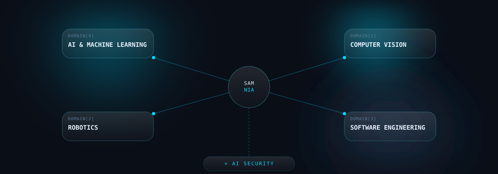

<div align="center">



<br/>


</div>

<br/>

```text
SYSTEM://amirsam-eftekhari
├── DOMAIN[0]  AI & MACHINE LEARNING
├── DOMAIN[1]  COMPUTER VISION
├── DOMAIN[2]  ROBOTICS
└── DOMAIN[3]  SOFTWARE ENGINEERING
```


## `01` — ABOUT

High-school student building systems at the intersection of **Artificial Intelligence**, **Computer Vision**, and **Robotics** — with a growing interest in **AI Security**.

I'd rather build than just study: exam-grading pipelines, offline computer-vision graders, gesture-based interfaces, and competition robotics systems. Currently exploring how classical CV, applied ML, and embedded robotics come together in real, physical systems.


## `02` — ENGINEERING SYSTEMS

<div align="center">



</div>


## `03` — SELECTED PROJECTS

<table>
<tr>
<td width="90" valign="top">

```
P01
```

</td>
<td>

### [GradeForge](https://github.com/AmirSam-Eftekhari/GradeForge)
<sub>`AI` &nbsp;`NLP`&nbsp; `EDUCATION` — STATUS: PUBLIC</sub>

AI-assisted system for grading written and long-answer exam responses.

</td>
</tr>
</table>

<table>
<tr>
<td width="90" valign="top">

```
P02
```

</td>
<td>

### [ExamCorrector](https://github.com/AmirSam-Eftekhari/ExamCorrector-)
<sub>`COMPUTER VISION` &nbsp;`OMR`&nbsp; `OFFLINE` — STATUS: PUBLIC</sub>

Offline, computer-vision-based OMR system for processing and grading exam sheets.

</td>
</tr>
</table>

<table>
<tr>
<td width="90" valign="top">

```
P03
```

</td>
<td>

### [HandGestureControl](https://github.com/AmirSam-Eftekhari/HandGestureControl)
<sub>`COMPUTER VISION` &nbsp;`REAL-TIME`&nbsp; `HCI` — STATUS: PUBLIC</sub>

Real-time computer-vision system for hand and gesture-based interaction.

</td>
</tr>
</table>

<table>
<tr>
<td width="90" valign="top">

```
P04
```

</td>
<td>

### Autonomous Systems / Robotics
<sub>`ROBOTICS` &nbsp;`AUTONOMY`&nbsp; `COMPETITION` — STATUS: TEAM PROJECT</sub>

Autonomous robotics systems built and iterated on for national and international competition. Code kept private per team policy.

</td>
</tr>
</table>


## `04` — MISSION LOG

| YEAR | EVENT | RESULT |
|:--|:--|:--|
| 2025 | RoboCup Iran Open | Participant |
| 2026 | IranOpen Junior | National Champion |
| 2026 | IranOpen Junior | Best Technical Challenge |
| 2026 | RoboCupJunior | 4th Place — World Finals |


## `05` — TECHNOLOGY MATRIX

<table>
<tr>
<th align="left" width="160">LANGUAGES</th>
<td>


</td>
</tr>
<tr>
<th align="left">AI / ML</th>
<td>


</td>
</tr>
<tr>
<th align="left">ROBOTICS</th>
<td>


</td>
</tr>
<tr>
<th align="left">TOOLS</th>
<td>


</td>
</tr>
</table>


## `06` — CREDENTIALS

<table>
<tr>
<th align="left" width="300">CREDENTIAL</th>
<th align="left" width="160">ISSUER</th>
<th align="left">VERIFICATION</th>
</tr>
<tr>
<td>Computer Vision Foundations</td>
<td>Ultralytics Academy</td>
<td><a href="https://academy.ultralytics.com/courses/computer-vision-foundations/certificate/18b45788-a066-4d91-8234-c339c9e24239">verify ↗</a></td>
</tr>
<tr>
<td>Building High-Performance YOLO Datasets</td>
<td>Ultralytics Academy</td>
<td><a href="https://academy.ultralytics.com/courses/dataset-readiness-for-yolo/certificate/cb676cf9-ac4f-43e2-808f-2287cf2eb135">verify ↗</a></td>
</tr>
<tr>
<td>Train Your First YOLO Model</td>
<td>Ultralytics Academy</td>
<td><a href="https://academy.ultralytics.com/courses/train-your-first-yolo/certificate/5384a777-e4e4-4cfd-9dce-589c86fbead1">verify ↗</a></td>
</tr>
</table>


## `07` — GITHUB ACTIVITY

<div align="center">


</div>


## `08` — CURRENT SYSTEM

```text
STATUS ................. ACTIVE
FOCUS ................... Computer Vision / AI / Robotics
MODE .................... Building & Iterating
```

<div align="center">


</div>
